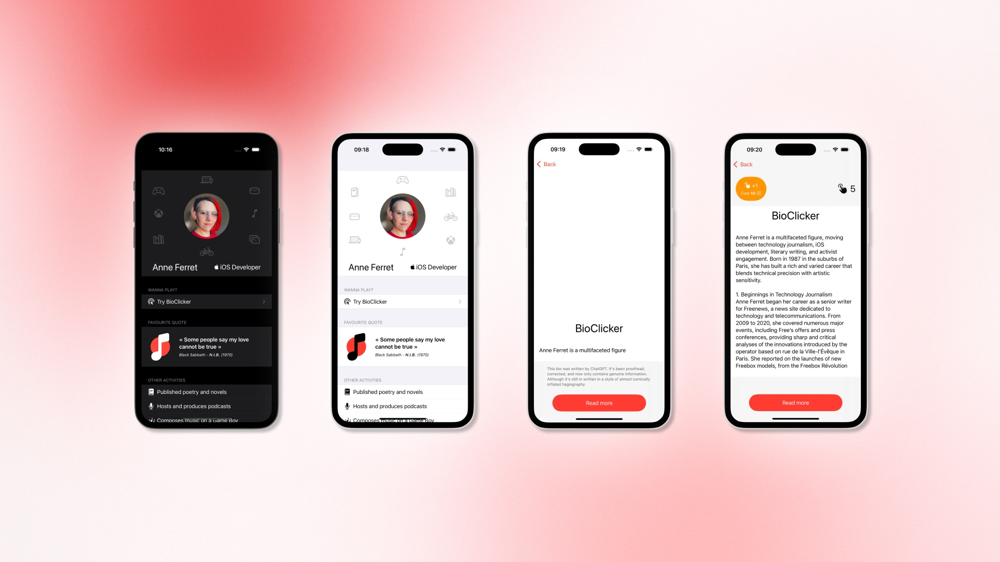

# BioClicker

*Boring personal biography meets Cookie Clicker!*

During Apple Foundation Program Advanced, we had to think about an original way to present an iOS interactive personal bio, using our (then) basic knowledge of Swift and SwiftUI. This led me to think about a simple, silly game, that I could add to the project: a huge wall of biographical text could be displayed tap-by-tap, letter-by-letter, in a very painful and inefficient manner. As the user progresses, some tongue-in-cheek messages start to appear, and a new bonus unlocks, making it easier to get to the end... with a trade-off.

It's an obvious nod to the well-known [Cookie Clicker](https://orteil.dashnet.org/cookieclicker/) and other games of that genre.

## Details
### Features
- profile page with some information, icons, and an easter-egg animation
- barebones "game", that takes a few minutes to finish
- iOS look-and-feel, dark-mode compliant

### Caveats
- it's still very much an early iOS project for me (and it shows in the code structure!)
- more features to the game like an auto-clicker based on timer could've been added. Maybe later?

### Who did it?
It's a 100% personal project.

The long wall of text was generated with the help of [ChatGPT](https://chatgpt.com) through some specific prompts to make it longer than it really should. It was then proofread and corrected to only contain genuine information.

### When?
- The initial iOS SwiftUI project was made in a day, in May 2025, during Apple Foundation Program Advanced.
- This version was a bit revised in August 2025 in a few hours, with a translatation from French to English, some minor refactoring, and the name "BioClicker" added in.
